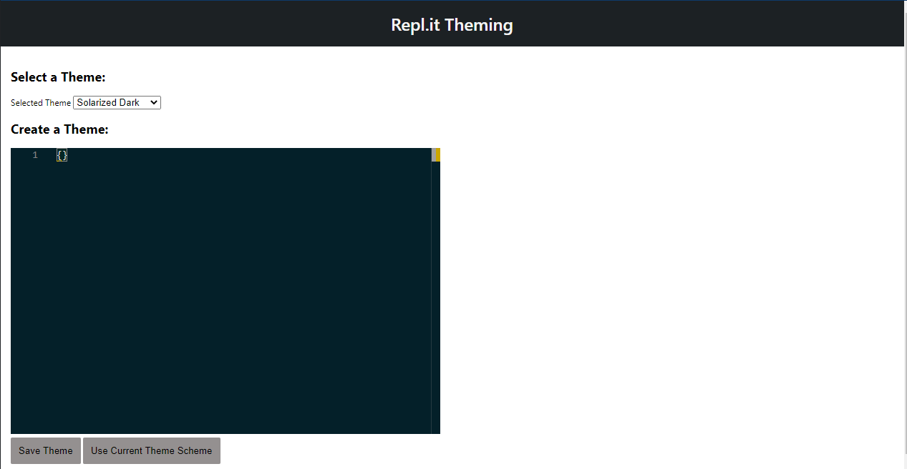
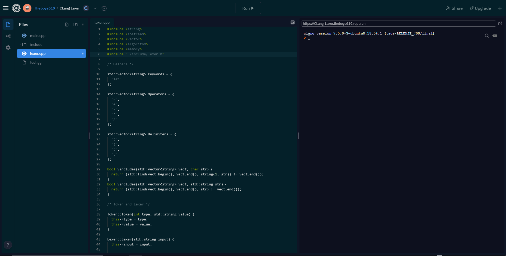

## Repl.it Themes Extension

This is extension is for the website [repl.it](https://repl.it).

The Themes Extension allows for the use of VSCode/Custom themes.
These themes will get applied to [repl.it's](https://repl.it) editor and sidebar.

The extension also has a options page where you can configure a theme that you like or you can set a default VSCode theme.

### Installation

**NOTE:** Only available for chrome.

- Download this github repository and extract the folder onto your desktop (or where ever you like).
- Go to [chrome://extensions](chrome://extensions)
- Turn on developer mode in the top right if it's not already on.
- Drag and drop the folder into the page or press load unpacked

The extensions should now be installed!

---

#### Options Page:

This page lets you select a theme that you created via Monaco's JSON themes or select a default VSCode theme.

